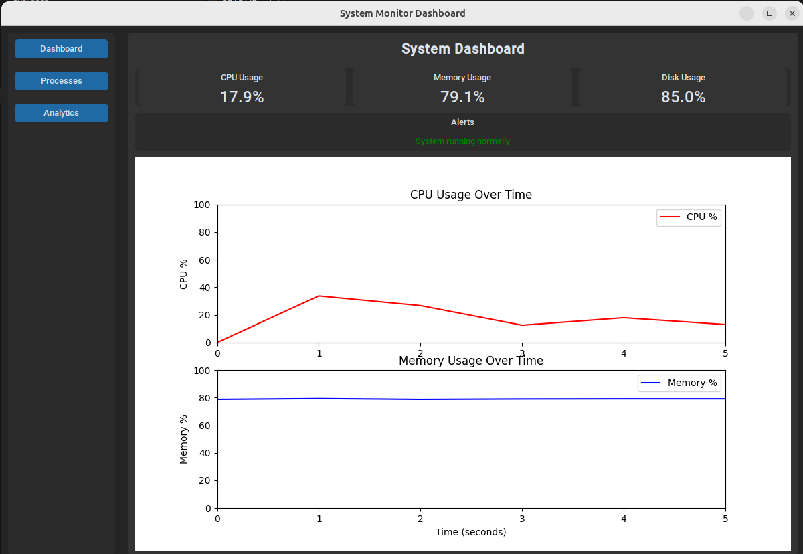
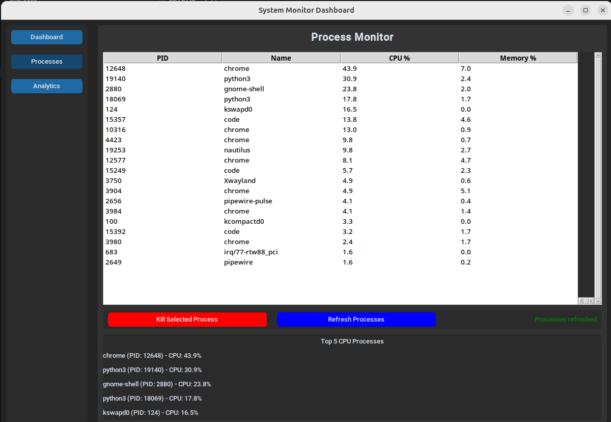
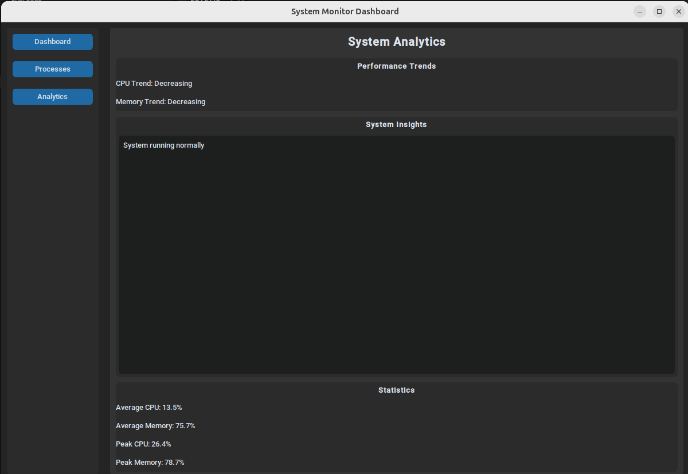

<div align="center">

# 🖥️ System Monitor Dashboard

**A real-time Linux system performance monitor built with Python**

[](https://www.python.org/)
[](https://www.linux.org/)
[](LICENSE)
[](https://github.com/TomSchimansky/CustomTkinter)

## 📸 Screenshots

### Dashboard


### Processes


### Analytics


</div>

---

## Overview

System Monitor Dashboard is a modern, real-time performance analysis tool for Linux. It provides a clean GUI to monitor CPU, memory, disk, and running processes — with live graphs, smart alerts, and process management — all without freezing the UI.

---

## ✨ Features

| Category | Details |
|---|---|
| **CPU Monitoring** | Overall and per-core usage with live graphs |
| **Memory Monitoring** | Total / used / available with usage percentage and live graphs |
| **Disk Monitoring** | Usage percentage and space breakdown |
| **Process Management** | Live process table sorted by CPU usage; kill processes from the UI |
| **Top Processes Panel** | Quick view of the top 5 CPU-consuming processes |
| **Live Alerts** | Dynamic warnings for high CPU or memory usage |
| **System Insights** | Auto-generated performance analysis and recommendations |
| **System Info** | OS details and uptime at a glance |

---

## 🚀 Getting Started

### Prerequisites

- Python 3.x
- Linux OS

### Installation

1. **Clone the repository**

   ```bash
   git clone https://github.com/your-username/system-monitor-dashboard.git
   cd system-monitor-dashboard
   ```

2. **Install dependencies**

   ```bash
   pip install customtkinter psutil matplotlib
   ```

3. **Run the application**

   ```bash
   python3 main.py
   ```

> **Note:** Process management (e.g. killing processes) may require elevated permissions depending on your system configuration.

---

## 🗂️ Project Structure

```
system-monitor-dashboard/
├── main.py                 # Entry point
├── core/
│   ├── data_collector.py   # Background data collection thread
│   └── data_model.py       # Shared data structures
├── ui/
│   ├── app.py              # Main application class
│   ├── dashboard.py        # Dashboard page
│   ├── process_page.py     # Process management page
│   └── analytics.py        # Analytics page
├── utils/
│   ├── system_utils.py     # System utility functions
│   └── process_utils.py    # Process utility functions
└── graphs/
    └── graph_manager.py    # Matplotlib graph management
```

---

## 🏗️ Architecture

The application uses a **producer-consumer pattern** to keep the UI responsive at all times.

```
┌─────────────────────┐         Queue          ┌──────────────────────┐
│    UI Thread        │  ◄──────────────────── │  Background Thread   │
│  CustomTkinter      │                         │  psutil data polling │
│  Updates @ 500ms    │                         │  Collects @ 1s       │
└─────────────────────┘                         └──────────────────────┘
```

- **UI Thread** — Runs the CustomTkinter mainloop and schedules updates every 500ms
- **Background Thread** — Collects system metrics via `psutil` every second
- **Thread-safe communication** — Data is passed through a `Queue`, eliminating race conditions

---

## 📖 Usage

Once launched, navigate between three pages using the sidebar:

- **Dashboard** — High-level overview of system metrics, live graphs, and active alerts
- **Processes** — Full process table with CPU/memory stats and process termination
- **Analytics** — Historical performance trends and auto-generated insights

---

## 🤝 Contributing

Contributions are welcome! Please open an issue to discuss your idea before submitting a pull request.

1. Fork the repository
2. Create a feature branch (`git checkout -b feature/your-feature`)
3. Commit your changes (`git commit -m 'Add your feature'`)
4. Push to the branch (`git push origin feature/your-feature`)
5. Open a Pull Request

---

## 📄 License

This project is licensed under the MIT License. See the [LICENSE](LICENSE) file for details.